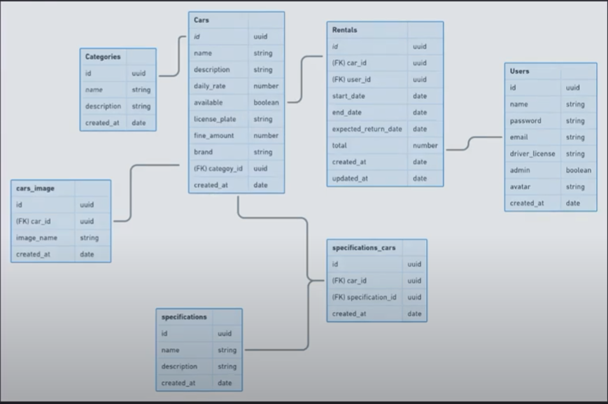

# rocketseat-ignite-node-first-project

  
  
  
  

Primeiro projeto da trilha Node.js do curso Ignite da rocketseat

## config

 - Run `npm install` to install project dependencies
 - Run `npm run dev` to start development server

## database

 

# Tools

 - [Express](https://expressjs.com/)
 - [Typescript](https://www.typescriptlang.org/)
 - [eslint](https://eslint.org/)
 - [prettier](https://prettier.io/)
 - [Node.js](https://nodejs.org/en/docs/)
 - [vscode](https://code.visualstudio.com/)
 - [insomnia](https://insomnia.rest/)
 - [uuid](https://www.npmjs.com/package/uuid)
 - [swagger](https://swagger.io/)
 - [docker](https://www.docker.com/)

## DTO

data transfer object - objeto para transferir dados entre camadas

usado para transferir dados de um local a outro na aplicação, sem lógica de negócios em seus objetos e comumente associado à transferência de dados entre uma camada de visão (view layer) e outra de persistência dos dados (model layer).

## S.O.L.I.D

SOLID é um acrônimo criado por Michael Feathers, após observar que cinco princípios da orientação a objetos e design de código — Criados por Robert C. Martin (a.k.a. Uncle Bob) e abordados no artigo The Principles of OOD — poderiam se encaixar nesta palavra.

 - S — Single Responsiblity Principle (Princípio da responsabilidade única)
 - O — Open-Closed Principle (Princípio Aberto-Fechado)
 - L — Liskov Substitution Principle (Princípio da substituição de Liskov)
 - I — Interface Segregation Principle (Princípio da Segregação da Interface)
 - D — Dependency Inversion Principle (Princípio da inversão da dependência)

### 1. SRP — Single Responsibility Principle:

Princípio da Responsabilidade Única — Uma classe deve ter um, e somente um, motivo para mudar.

Esse princípio declara que uma classe deve ser especializada em um único assunto e possuir apenas uma responsabilidade dentro do software, ou seja, a classe deve ter uma única tarefa ou ação para executar.

### 2. OCP — Open-Closed Principle:
 
Princípio Aberto-Fechado — Objetos ou entidades devem estar abertos para extensão, mas fechados para modificação, ou seja, quando novos comportamentos e recursos precisam ser adicionados no software, devemos estender e não alterar o código fonte original.

### 3. LSP— Liskov Substitution Principle:

Princípio da substituição de Liskov — Uma classe derivada deve ser substituível por sua classe base.

O princípio da substituição de Liskov foi introduzido por Barbara Liskov em sua conferência “Data abstraction” em 1987. A definição formal de Liskov diz que:

Se para cada objeto o1 do tipo S há um objeto o2 do tipo T de forma que, para todos os programas P definidos em termos de T, o comportamento de P é inalterado quando o1 é substituído por o2 então S é um subtipo de T

Um exemplo mais simples e de fácil compreensão dessa definição. Seria:

se S é um subtipo de T, então os objetos do tipo T, em um programa, podem ser substituídos pelos objetos de tipo S sem que seja necessário alterar as propriedades deste programa.

### 4. ISP — Interface Segregation Principle:
   
Princípio da Segregação da Interface — Uma classe não deve ser forçada a implementar interfaces e métodos que não irão utilizar.

Esse princípio basicamente diz que é melhor criar interfaces mais específicas ao invés de termos uma única interface genérica.

### 5. DIP — Dependency Inversion Principle:
   
Princípio da Inversão de Dependência — Dependa de abstrações e não de implementações.

De acordo com Uncle Bob, esse princípio pode ser definido da seguinte forma:

1. Módulos de alto nível não devem depender de módulos de baixo nível. Ambos devem depender da abstração.

2. Abstrações não devem depender de detalhes. Detalhes devem depender de abstrações.

No contexto da programação orientada a objetos, é comum que as pessoas confundam a Inversão de Dependência com a Injeção de Dependência, porém são coisas distintas, mas que relacionam entre si com um proposito em comum, deixar o código desacoplado.

## Paterns

### Singleton

Singleton é um padrão de design criacional que permite garantir que uma classe tenha apenas uma instância, enquanto fornece um ponto de acesso global a essa instância.

 

---

Desenvolvido Por [Alessandro Massarotti Jr](https://github.com/alessandro-massarotti-jr) 🤖